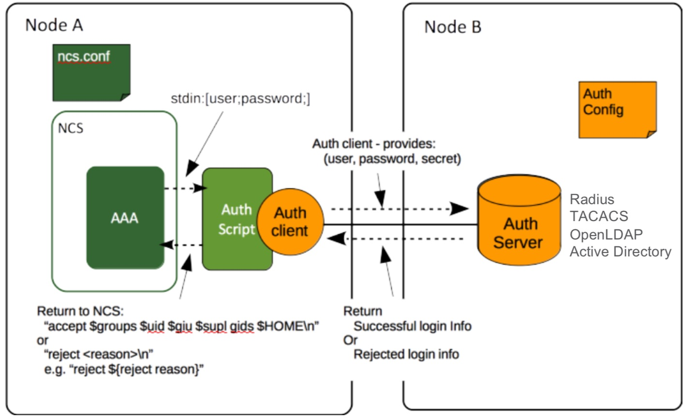

## NSO LDAP Authentication and Authorization

### Table of contents
 - [Introduction](#introduction)
 - [Background](#background)
   - [NSO LDAP External Authentication Architecture](#nso-ldap-external-authentication-architecture)
   - [NSO configuration](#nso-configuration)
   - [Authentication executable](#authentication-executable)
 - [Package Installation](#package-installation)
   - [Prerequisites](#prerequisites)
   - [Installation Procedure](#installation-procedure)
 - [NSO LDAP Configuration](#nso-ldap-configuration)
 - [Testing](#testing)


### Introduction
The goal for this project is to leverage LDAP user authentication server for external authentication of NSO users.
Here we assume that LDAP server is installed and connection to it from the NSO server is established.
The detail instruction on LDAP server and client installation and initial configuration can be found
[here](https://www.howtoforge.com/how-to-install-and-configure-openldap-phpldapadmin-on-ubuntu-2004/).

To enable user authorization using LDAP the users must be grouped to certain groups and corresponding groups should be
configured in NSO AAA for authentication and NACM for access authorization. For NACM configuration details see documentation at
`$NCS_DIR/doc/html/nso_admin_guide/ug.aaa.authorization.html` from your NSO installation. For openLDAP configuration,
which allows associating users with authorization groups, please follow [these](README-Building-MemberOf-Module-in-LDAP.md)
instructions. The [Microsoft Active Directory](https://ldapwiki.com/wiki/MemberOf) implementation of LDAP server
has the _memberOf_ attribute enabled by default and does not need special configuration.
>Note: It is assumed, that if the LDAP user is not associated with any authorization group (does not have attribute
_memberOf_), the NSO access will be denied.

### Background 

#### NSO LDAP External Authentication Architecture


To interface with an external authentication entity such as LDAP server,
the user needs to provide an authentication script/program that will interact with the specific authentication method.
The purpose of the script is not only soliciting the remote authentication server for user/password acceptance
but also determining groups that are associated with the user. On the LDAP server a _memberOf_ module must be added
to the database and groups with associated members must be created.
These groups then returned from the script to NSO, prepended to any group information stored locally under the
_/aaa_ tree, and used by the NSO authorization process when checking _nacm_ rules.

> For more details on how external authentication works, see the documentation at
`$NCS_DIR/doc/html/nso_admin_guide/ug.aaa.External_authentication.html` from your NSO installation.
Also, a presentation on access control with NSO is included in this repo:
[NSO Access Control Role based and Resource based Access](resources/NSODevDays2020-NSO-Access-Control-Role-based-and-Resource-based-Access.pdf)

#### NSO configuration

To enable external authentication the NSO base configuration in _ncs.conf_ must include an _<external-authentication>_
definition under the _<aaa>_ configuration and provide path to the authentication executable. It also should provide
order of authentication methods in case multiple methods are enabled:
```
<aaa>
    <external-authentication>
        <enabled>true</enabled>
        <executable>./scripts/python/ldap-auth.py</executable>
    </external-authentication>
    <auth-order>external-authentication local-authentication pam</auth-order>
</aaa>
```

#### Authentication executable
External Authentication for NSO is accomplished by creating some executable script that NSO calls when user tries
to login.  NSO simply passes user credentials to the script via standard input and expects an output statement in some
expected formats. What is done in the external authentication script is irrelevant to NSO, all that matters is the output.
For example, this script would work just fine, but will result in any provided credentials passing authentication and
being authorized for both admin and operator roles:

```python
#! /usr/bin/env python3 

accept = "accept admin oper 1004 1004 /tmp"
print(accept)
```

When user creates SSH or Netconf or Restconf session with NSO server, it invokes the external authentication executable
(in case of this package - Python script _ldap_auth.py_) and puts on the _stdin_ a message, which is then should be
received and processed by that executable. The format of the message is:
> [username;password]

The external authentication executable must put on the _stdout_ a message in one of these formats:
 - accept $groups $uid $gid $supplementary_gids $HOME
    * Issued when external authentication succeeded and NSO associated groups are determined. The parameters of the 
_accept_ statement are:
      * $groups - space separated list of the group names the user is a member of.
      * $uid - UNIX integer user id NSO should use as default when executing commands for this user.
      * $gid - UNIX integer group id NSO should use as default when executing commands for this user.
      * $supplementary_gids - (possibly empty) space separated list of additional UNIX group ids the user is also
 a member of.
 - reject $message
    * Issued when authentication with external server failed. When received, the NSO can try other available methods
 like PAM or local-authentication.
 - abort $message
    * Issued when authentication with external server failed and no other authentication methods are allowed.

### Package Installation

#### Prerequisites

The Python script _ldap_auth.py_ requires Python package _python-ldap_; to install it run the command:
```
pip install python-ldap
```

NACM system must be configured to have user groups that are assigned to users by LDAP with corresponding configuration
of permitted actions and commands. By default, the NSO comes with two NACM configured groups: _admin_ and _oper_.
The _admin_ group allows all the actions, and the _oper_ allows only read and execute actions. The LDAP administrator
can choose to employ these groups, but also can configure other multiple groups. In this case these groups must be added
into NACM configuration with corresponding action and commands permissions.

#### Installation procedure
Here we assume that this package is cloned to _$HOME_ directory and _ncs_ is running. Please follow below steps.
1. Copy package components to NSO:
   ```
   cd /your/nso/working/directory/
   cp -R $HOME/ldap-auth/packages/ldap-config packages/
   cp -R $HOME/ldap-auth/scripts/python scripts/
   ```
2. Compile YANG model:
   ```
   cd packages/ldap-config/src/
   make all
   cd -
   ```
3. Configure _ncs.conf_
    > Add AAA system configuration presented in section [NSO configuration](#nso-configuration)
4. Restart NSO:
   ```
   ncs --reload --with-package-reload
   ```
   
### NSO LDAP configuration
The package defines YANG model _ldap_config.yang_, which describes LDAP server communication settings.
The model tree defined like this:
```
module: ldap-config
  +--rw ldap
     +--rw server?           string
     +--rw login!
     |  +--rw username?   string
     |  +--rw password?   tailf:aes-256-cfb-128-encrypted-string
     +--rw base-dn?          string
     +--rw user-dn-prefix?   string
     +--rw user-dn-group?    string
```
where:
 - _server_ defines URL address of LDAP server including port,
         for example: ldap://ds.example.com:636
 - _base-dn_ - LDAP base distinguished name, for example: DC=example,DC=com
 - _user-dn-prefix_ - user distinguished name prefix, for example: cn or uid
 - _user-dn-group_ - user organizational unit distinguished name, example: ou=people
 - _login_ is a presence container, which serves to configure LDAP user credentials: _username_ and _password_

Here is an example on how the LDAP configuration could be done in the NSO:
```
$ ncs_cli -u admin

User admin last logged in 2022-07-15T16:07:27.699951+00:00, to YGORELIK-M-C3GG, from 127.0.0.1 using cli-console
admin connected from 127.0.0.1 using console on YGORELIK-M-C3GG
admin@ncs# config
Entering configuration mode terminal
admin@ncs(config)# ldap server ldap://172.23.80.31:389 base-dn dc=example,dc=com user-dn-prefix uid user-dn-group ou=people login admin cisco123
admin@ncs(config)# commit
Commit complete.
admin@ncs(config)# exit
admin@ncs# show running-config ldap
ldap server    ldap://172.23.80.31:389
ldap login admin $9$09zmqqegUgJFwp1i2Fp6mp7c6FOwn3EM4p+wWgCX4vE=
ldap base-dn   dc=example,dc=com
ldap user-dn-prefix uid
ldap user-dn-group ou=people
admin@ncs(config)# 
```

### Testing
1. SSH login with user from _oper_ group:
```
bash$ ssh ygorelik@127.0.0.1 -p 2024
ygorelik@127.0.0.1's password:
```

Check _logs/audit.log_ file for authentication message:
```
: ygorelik/0 external authentication succeeded via cli from 127.0.0.1:58910 with ssh, member of groups: oper
: ygorelik/0 logged in via cli from 127.0.0.1:58910 with ssh using external authentication
: ygorelik/124 assigned to groups: oper
: ygorelik/124 created new session via cli from 127.0.0.1:58910 with ssh
```
